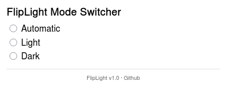

# FlipLight – Firefox Appearance Mode Switcher

**FlipLight** is a lightweight Firefox extension that lets you quickly switch the browser's appearance between **Light**, **Dark**, and **Automatic** modes — directly from your toolbar.



---

## Features

- One-click toggle between Light, Dark, and Auto
- Remembers your last preference
- Clean and minimal popup UI

---
## 🧩 Installation

### 🦊 Temporary (Development/Test)

1. Open Firefox and go to `about:debugging`
2. Click on **"This Firefox"**
3. Click **"Load Temporary Add-on…"**
4. Select the `manifest.json` file from this repo

> ⚠️ This is for development only. It will be removed when Firefox restarts.

---

## 🛠️ Build Instructions

### Requirements

- OS: Linux/macOS (Windows via WSL or Git Bash)
- Tools: `bash`, `zip` (pre-installed on most Unix systems)

### Steps

```bash
git clone https://github.com/yourusername/FlipLight.git
cd FlipLight
chmod +x build.sh
./build.sh
