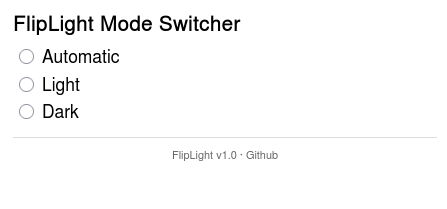

# FlipLight

**Quick Firefox Appearance Mode Switcher Extension**

*Instantly switch between Light, Dark, and Auto themes with one click*

---

## What is FlipLight?

**FlipLight** is a lightweight Firefox extension that lets you quickly switch your browser's appearance between **Light**, **Dark**, and **Automatic** modes directly from your toolbar — no need to dig through settings menus!

*Simple, clean interface with one-click theme switching*

## Installation

### From Firefox Add-ons (Recommended)

1. Visit the [FlipLight AMO page](https://addons.mozilla.org/firefox/addon/fliplight/)
2. Click **"Add to Firefox"**
3. Confirm installation
4. Look for the  icon in your toolbar!

### For Developers (Temporary)

1. Download this repository
2. Open Firefox and navigate to `about:debugging`
3. Click **"This Firefox"** 
4. Click **"Load Temporary Add-on..."**
5. Select the `manifest.json` file from the downloaded folder

>  **Note:** Temporary installations are removed when Firefox restarts.

## How to Use

1. **Click the FlipLight icon** in your toolbar
2. **Choose your preferred mode:**
   - **Light** — Bright theme for daytime browsing
   - **Dark** — Easy on the eyes for night sessions  
   - **Auto** — Automatically follows your system theme

That's it! Your preference is saved automatically.

## Build Instructions

### Prerequisites
- **OS:** Linux/macOS (Windows via WSL or Git Bash)
- **Tools:** `bash`, `zip` (pre-installed on most systems)

## Contributing

Contributions are welcome! Please feel free to:

- [Report bugs](https://github.com/AbdulOhab/FlipLight/issues)
- [Suggest features](https://github.com/AbdulOhab/FlipLight/issues)  
- [Submit pull requests](https://github.com/AbdulOhab/FlipLight/pulls)

## License

This project is licensed under the **MIT License** - see the [LICENSE](LICENSE) file for details.

